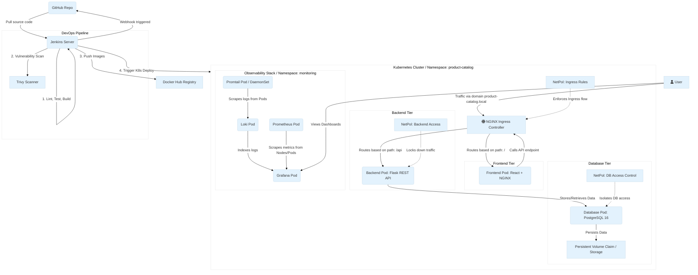

# Product Catalog Platform
A cloud-native **Product Catalog Platform** built using **React**, **Flask**, and **PostgreSQL**, containerized with **Docker**, orchestrated using **Kubernetes (Kind)**, and automated with a **Jenkins CI/CD Pipeline**. The project also includes **NGINX Ingress**, **Network Policies**, **Prometheus**, **Grafana**, **Loki**, and **Promtail** for monitoring, logging, and secure networking.


---
## 🚀 Features
- React frontend served with NGINX
- Flask REST API backend
- PostgreSQL database
- Dockerized frontend and backend
- Kubernetes Deployments and Services
- NGINX Ingress Controller
- Persistent Volume for PostgreSQL
- ConfigMaps and Secrets
- Kubernetes Network Policies
- Jenkins CI/CD Pipeline
- Trivy Security Scanning
- Docker Hub Image Publishing
- Prometheus Monitoring
- Grafana Dashboards
- Loki + Promtail Centralized Logging
- Rolling Updates
- Health Checks (Liveness & Readiness Probes)

---

# 📥 Clone the Repository
```bash
git clone https://github.com/anusree-ux/product-catelog-app.git
cd product-catelog-app
```
---

# 🏗️ Architecture

---

# 🛠️ Tech Stack
| Category | Technologies |
|----------|--------------|
| Frontend | React, Vite, NGINX |
| Backend | Flask, SQLAlchemy |
| Database | PostgreSQL |
| Containers | Docker |
| Container Orchestration | Kubernetes (Kind) |
| CI/CD | Jenkins |
| Monitoring | Prometheus |
| Visualization | Grafana |
| Logging | Loki, Promtail |
| Security | Kubernetes Network Policies, Trivy |

---

# ☸️ Kubernetes Resources
The application is deployed using the following Kubernetes resources:

- Namespace
- Deployments
- Services
- Ingress
- ConfigMaps
- Secrets
- Persistent Volume Claim (PVC)
- Network Policies


---

# 📊 Monitoring
Monitoring is implemented using:
- Prometheus
- Grafana
- kube-state-metrics
- Node Exporter

Monitored metrics include:
- CPU Usage
- Memory Usage
- Pod Status
- Kubernetes Cluster Health
- Application Metrics


---

# 📝 Centralized Logging
The logging stack consists of:

- Promtail
- Loki
- Grafana

Logs from Kubernetes pods are collected by Promtail, stored in Loki, and visualized using Grafana.


---

# 🔄 Jenkins CI/CD Pipeline
The Jenkins pipeline automates the entire deployment process.

Pipeline stages:
1. Checkout Source Code
2. Install Dependencies
3. Lint Frontend
4. Run Unit Tests
5. Build Docker Images
6. Scan Images with Trivy
7. Push Images to Docker Hub
8. Deploy Updated Images to Kubernetes
9. Validate Deployment


---
# 🐳 Docker Compose
Run the application locally using the helper script.

Start the application:
```bash
./deploy.sh start
```
Stop the application:
```bash
./deploy.sh stop
```
Restart the application:
```bash
./deploy.sh restart
```
Check the status:
```bash
./deploy.sh status
```
---

# ☸️ Kubernetes Deployment
Deploy the application to a Kind cluster:

```bash
./scripts/bootstrap-kind.sh
```

Verify the deployment:

```bash
kubectl get pods -n product-catalog
kubectl get svc -n product-catalog
kubectl get ingress -n product-catalog
```

Access the application:

```
http://product-catalog.local
```
---
# 📄 License
This project is intended for learning and portfolio purposes.
